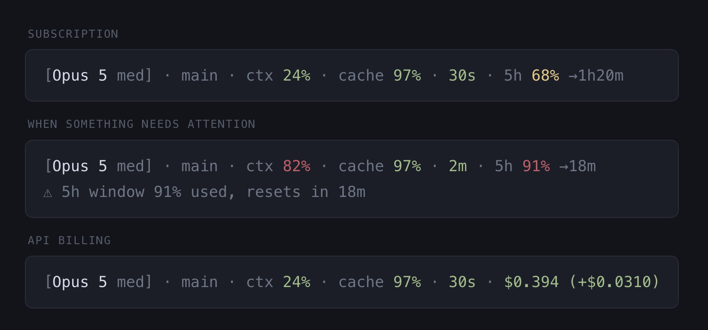

# claude-code-cost-aware-statusline

A status line for [Claude Code](https://claude.ai/code) that shows context usage,
cache health, idle time, and what you are spending - plan usage on a
subscription, dollars on API billing.



## Why

Claude Code shows basic session info, but not the numbers that drive your costs:
cache hit rate, idle time against the cache TTL, and how much of your plan you
have burned through. This script surfaces those so you know when a message will
be cheap and when it won't.

Labels and separators are dim, so only the values carry color. One scale
everywhere - **green = fine, yellow = watch, red = act** - which means you read
the line by color and only look at digits when something isn't green.

## What you see

On a subscription:

```
[Opus 5 med] · main · ctx 24% · cache 97% · 30s · 5h 68% →1h20m
```

On API billing:

```
[Opus 5 med] · main · ctx 24% · cache 97% · 30s · $0.394 (+$0.0310)
```

| Field | What it means |
|-------|---------------|
| `[Opus 5 med]` | Active model and effort level (`low`/`med`/`high`/`xhi`/`max`) |
| `main` | Git branch (hidden outside repos) |
| `ctx 24%` | Context window fill - green <50%, yellow 50-80%, red 80%+ |
| `cache 97%` | Prompt cache hit rate this turn - green >10%, red ≤10% |
| `30s` | Time since your last turn, colored against the detected cache TTL |
| `5h 68% →1h20m` | Share of the 5-hour usage window spent, and when it resets |
| `wk 74%` | Weekly window - appears only when it is the binding constraint |
| `$0.394 (+$0.0310)` | Session cost + last turn's delta - yellow >$0.50, red >$2.00 |

A second line appears when something needs attention: usage window nearly spent,
context pressure, a mid-session cache rebuild, a cold cache, or first-turn warmup.

## How it decides what to show

- **Usage vs. dollars** is automatic. The status line payload carries
  `rate_limits` only on a subscription, so subscriptions get usage windows and
  API billing gets dollars. Override with
  `CLAUDE_STATUSLINE_UNITS=usage|cost|both` if you want both, or want dollars on
  a seat that reports rate limits.
- **Cache TTL is detected, not assumed.** The payload has no TTL field, but the
  session transcript records which bucket each cache write landed in
  (`cache_creation.ephemeral_1h_input_tokens` vs `ephemeral_5m_input_tokens`).
  The idle thresholds follow the observed TTL: 30m/60m on a 1-hour cache,
  3m/5m on a 5-minute one.
- **The weekly window stays hidden** until it exceeds the 5-hour window or
  crosses 50%, so the line stays short until the weekly cap is the thing that
  will actually stop you.

## Install

**1. Copy the script**

```sh
curl -o ~/.claude/statusline.sh \
  https://raw.githubusercontent.com/ArturGR3/claude-code-cost-aware-statusline/main/statusline.sh
chmod +x ~/.claude/statusline.sh
```

**2. Add to `~/.claude/settings.json`**

```json
{
  "statusLine": {
    "type": "command",
    "command": "bash ~/.claude/statusline.sh",
    "refreshInterval": 30
  }
}
```

**3. Restart Claude Code** - the status line appears immediately.

Requires `bash`, `jq`, `awk`, and `git`. Per-session state lives in
`~/.cache/claude-statusline/` and is pruned after 7 days.
